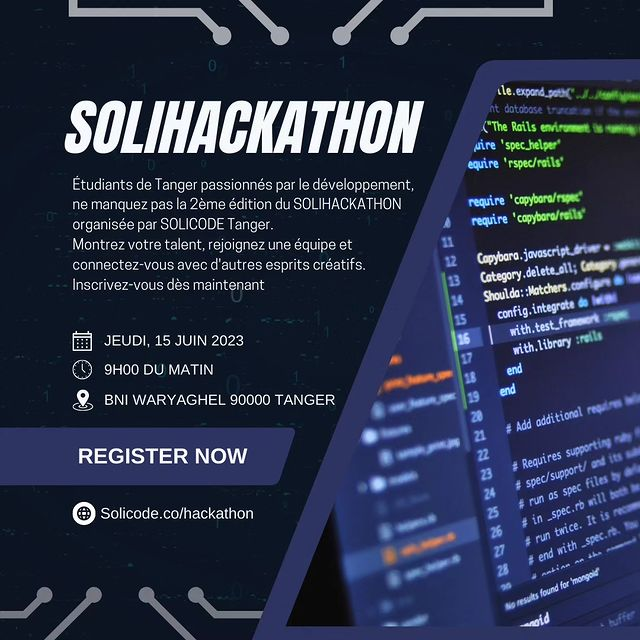

# solicode journal 

### ***Headline: L'hackathon de SoliCode se rapproche bientôt - Un événement phare pour les passionnés de codage***

**30 novembre 2023**

Dans le monde florissant de la technologie et du développement informatique, les amateurs de codage du monde entier attendent avec impatience l'événement phare de l'année : l'hackathon de SoliCode. Cet événement annuel, connu pour rassembler des esprits créatifs et innovants, se rapproche à grands pas, promettant une compétition féroce et des avancées technologiques remarquables.

## SoliCode : Un événement incontournable

**SOLICODE**,  est un centre de formation solidaire et inclusif, ouvert aux jeunes motivés et intéressés par les métiers du Développement Web et Mobile. L’apprenant à SOLICODE se considère comme acteur principal tout au long de son processus d’apprentissage. C’est lui qui construit ses savoirs à travers la réalisation des projets, individuels ou par groupe, inspirés du milieu professionnel afin de favoriser une meilleure insertion au marché de travail. La formation au sein de SOLICODE est axée sur différents volets: technique, soft-skills, entreprenariat et gestion de projet. A l’issue de cette formation,

### Technologies émergentes à l'honneur

Cette année, l'hackathon de SoliCode mettra l'accent sur les technologies émergentes telles que l'intelligence artificielle, la blockchain, l'Internet des objets (IoT) et la cybersécurité. Les participants auront l'opportunité de collaborer avec des experts de l'industrie, de perfectionner leurs compétences et de créer des solutions novatrices qui pourraient façonner l'avenir de la technologie.

### Défis et Récompenses

Les équipes participantes auront un temps limité pour concevoir, développer et présenter leurs projets devant un panel de juges chevronnés, composé de professionnels de l'industrie et d'experts renommés. Des prix substantiels, ainsi que la reconnaissance mondiale, attendent les équipes les plus créatives et les plus performantes.

> "Nous sommes ravis d'organiser à nouveau notre hackathon annuel. SoliCode a toujours été un fervent défenseur de l'innovation et de l'excellence dans le domaine du codage. Cet événement offre une plateforme unique pour que les esprits brillants du monde entier se réunissent, partagent leurs idées et façonnent l'avenir de la technologie", a déclaré Sophie Leclerc, la fondatrice de SoliCode.

### Inscriptions et Réseautage

Les inscriptions pour l'événement sont actuellement ouvertes, et l'excitation monte à mesure que la date approche. Les passionnés de codage, les développeurs et les étudiants en informatique sont tous invités à participer à cette aventure stimulante.

L'hackathon de SoliCode ne se contente pas d'être une compétition, mais aussi un lieu de réseautage exceptionnel où les participants auront l'occasion de rencontrer des mentors de l'industrie, d'échanger des idées et de tisser des liens durables.

## Restez Informés

Restez à l'écoute pour des mises à jour en direct pendant l'événement, car nous couvrirons les moments forts, les projets révolutionnaires et les histoires inspirantes des participants. L'hackathon de SoliCode s'annonce déjà comme un rendez-vous incontournable pour les passionnés de technologie du monde entier.

